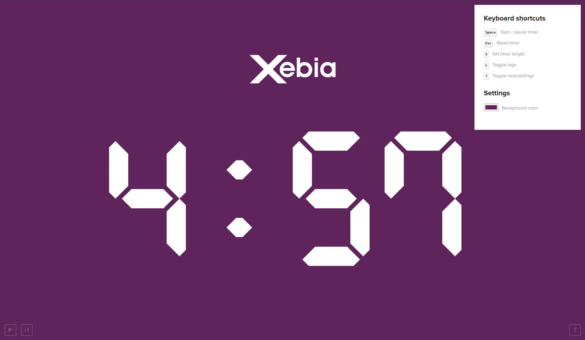

# Demo timer

This is a simple PWA to run a Xebia branded timer during Innovation Day demos.

It is 100% keyboard controllable but also works on mobile and tablet.



## Project setup

This project works with at least Node 14.19 and Npm 8.16

```
npm install
```

### Compiles and hot-reloads for development

```
npm run serve
```

### Compiles and minifies for production

```
npm run build
```

### Run your unit tests

```
npm run test:unit
```

### Lints and fixes files

```
npm run lint
```

### Deploy

This project is deployed on Firebase automatically in CircleCI using a deployment token.
If you want to deploy manually, you need Firebase project access.

```
firebase login
npm run deploy
```
